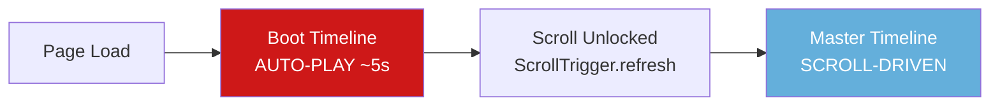

# INSERT_NAME — PROJECT 001: Complete Documentation

## Overview

A scroll-driven interactive prototype of a **fictional video editing application** built by INSERT_NAME. The visitor watches a choreographed editing session unfold — clips are selected, rejected, assembled into a timeline, cut, finished, and played. When PLAY is pressed, the preview monitor expands to fill the entire screen, revealing the portfolio introduction.

**Stack**: React 19 + JavaScript + Vite 8 + GSAP 3 (ScrollTrigger)

**Dev server**: `http://localhost:5173/`

---

## How to Run

```bash
cd d:/PROGRAMMING/WebDev/Insert-name-video-editing

# Development
npm run dev        # → http://localhost:5173/

# Production build
npm run build      # → dist/
npm run preview    # Serve the production build
```

---

## Dependencies

| Package | Version | Purpose |
|---------|---------|---------|
| `react` | ^19.2.8 | UI framework |
| `react-dom` | ^19.2.8 | React DOM renderer |
| `gsap` | ^3.15.0 | Animation engine + ScrollTrigger |
| `vite` | ^8.3.0 | Build tool + HMR |
| `@vitejs/plugin-react` | ^6.1.1 | React Fast Refresh |

No other runtime dependencies. Zero backend. Zero database.

---

## Project Structure

```
d:/PROGRAMMING/WebDev/Insert-name-video-editing/
├── index.html                                    # Entry HTML, title: INSERT_NAME® — PROJECT_001
├── package.json
├── vite.config.js
│
├── src/
│   ├── main.jsx                                  # React mount point, imports globals.css
│   ├── App.jsx                                   # ★ MASTER ORCHESTRATOR — boot + scroll timeline
│   │
│   ├── data/
│   │   └── project.js                            # Clip data, project metadata, phases, tools
│   │
│   ├── styles/
│   │   └── globals.css                           # Design tokens, reset, scrollbar, noise, reduced-motion
│   │
│   ├── components/
│   │   ├── editor/
│   │   │   ├── EditorShell.jsx                   # CSS Grid layout shell (7 panels)
│   │   │   ├── TopBar.jsx                        # INSERT_NAME® | PROJECT_001 | 24FPS 4K SYSTEM READY
│   │   │   ├── MediaBin.jsx                      # 6 clips with thumbnails, IDs, durations, metadata
│   │   │   ├── Preview.jsx                       # Monitor — becomes the fullscreen reveal target
│   │   │   ├── Inspector.jsx                     # Project/clip metadata, finishing checklist
│   │   │   ├── Timeline.jsx                      # V1/A1 tracks, clip blocks, timecode ruler
│   │   │   ├── Toolbar.jsx                       # SELECT / MOVE / CUT / PLAY buttons
│   │   │   └── Playhead.jsx                      # Red vertical playhead line with triangle
│   │   │
│   │   └── effects/
│   │       ├── CustomCursor.jsx                  # Crosshair cursor, GSAP quickTo, 6 states
│   │       ├── DissolveEffect.jsx                # CSS fragment dissolve (48 pieces max)
│   │       └── Noise.jsx                         # SVG feTurbulence grain overlay
│   │
│   └── animations/
│       ├── editorIntro.js                        # Boot text + editor panel assembly
│       ├── selection.js                          # Cursor inspects/selects/rejects clips
│       ├── timeline.js                           # Assembly + cutting + finishing timelines
│       └── reveal.js                             # PLAY → fullscreen expand → end credits
```

**21 source files** • **~80KB total source** • **~122KB gzipped production build**

---

## Architecture

### Two-Phase Animation System

The experience uses **two independent GSAP timelines**:



#### Phase 1: Boot Timeline (Auto-Play)
- Created synchronously in `useLayoutEffect`
- `document.body.style.overflow = 'hidden'` locks scrolling during boot
- Plays automatically with `delay: 0.5`
- Sequence: dark screen → boot lines appear → "SYSTEM INITIALIZING..." pulses → "PROJECT READY" → boot fades → editor panels assemble → "SCROLL TO EDIT" indicator appears
- On completion: unlocks scroll, hides boot screen, calls `ScrollTrigger.refresh(true)`

#### Phase 2: Master Timeline (Scroll-Driven)
- Also created synchronously (same GSAP context — critical for registration)
- Bound to ScrollTrigger with `scrub: 1.5`
- Trigger: `.scroll-container` (800vh tall)
- Pinning: `position: sticky` on `.pinned-viewport` (pure CSS, no GSAP pin)

### Scroll → Animation Mapping

| Scroll % | Phase | What Happens |
|----------|-------|--------------|
| 0–8% | IMPORT | Cursor fades in, moves to media bin |
| 8–35% | SELECT/REJECT | Cursor inspects 6 clips, selects 3, rejects 3 with dissolve |
| 35–50% | ASSEMBLE | Kept clips dragged from bin to timeline V1 track |
| 50–65% | CUT | Rapid cursor movements, playhead scrub, clips tighten |
| 65–75% | FINISH | MOTION → COLOR → SOUND finishing montage |
| 75–85% | READY | "EDIT COMPLETE" in preview, PLAY button glows red |
| 85–100% | REVEAL | Cursor → PLAY → click → preview expands to fullscreen → credits |

---

## File-by-File Documentation

### [App.jsx](file:///d:/PROGRAMMING/WebDev/Insert-name-video-editing/src/App.jsx) — Master Orchestrator

The brain of the experience. Contains:
- All ref declarations for major sections
- `useLayoutEffect` with a single `gsap.context()` scope
- DOM element queries (panels, clips, timeline, toolbar, preview)
- Initial state setup via `gsap.set()`
- Boot timeline construction (auto-play)
- Scroll timeline construction (scroll-driven)
- Dissolve callback implementation (inline, creates 24 DOM fragments)
- JSX structure: Noise → Cursor → ScrollContainer → PinnedViewport → Boot/Editor/Indicator/EndScreen
- All CSS for boot screen, scroll container, pinned viewport, end credits, scroll indicator

---

### [project.js](file:///d:/PROGRAMMING/WebDev/Insert-name-video-editing/src/data/project.js) — Data Layer

```
PROJECT: { name, creator, system, fps, resolution: {w, h}, resolutionLabel, duration }
CLIPS[6]: { id, duration, meta, keep: boolean, color }
TOOLS[4]: { id, label, shortcut }
PHASES: enum of all phase strings
```

Clips 002, 004, 006 have `keep: true`. Clips 001, 003, 005 have `keep: false`.

---

### [globals.css](file:///d:/PROGRAMMING/WebDev/Insert-name-video-editing/src/styles/globals.css) — Design Tokens

```css
--void: #050505      /* Deepest background */
--deep: #090909      /* Panel backgrounds */
--surface: #101010   /* Elevated surfaces */
--text: #f2f2f2      /* Primary text */
--muted: #707070     /* Secondary text, labels */
--dante: #CE1818     /* Red — creative/action */
--vergil: #64AFDB    /* Blue — system/info */
--glass: rgba(255,255,255,0.04)
--border: rgba(255,255,255,0.10)
```

Includes: box-sizing reset, body styling, `cursor: none` (desktop), custom selection color (dante red), thin scrollbar, `prefers-reduced-motion` support, noise overlay class, mobile cursor restore.

---

### Editor Components

#### [EditorShell.jsx](file:///d:/PROGRAMMING/WebDev/Insert-name-video-editing/src/components/editor/EditorShell.jsx)
CSS Grid layout: `grid-template-rows: 40px 1fr 180px 44px` × `grid-template-columns: 260px 1fr 240px`. Wraps all panels with `.panel-*` class divs for GSAP targeting. Mobile: collapses to single column, hides media bin and inspector.

#### [TopBar.jsx](file:///d:/PROGRAMMING/WebDev/Insert-name-video-editing/src/components/editor/TopBar.jsx)
Left: `INSERT_NAME®` (muted, letter-spaced). Center: `PROJECT_001`. Right: `24 FPS` and `4K` badges (vergil blue borders), `SYSTEM READY` with glowing blue dot.

#### [MediaBin.jsx](file:///d:/PROGRAMMING/WebDev/Insert-name-video-editing/src/components/editor/MediaBin.jsx)
2-column grid of 6 clips. Each clip: gradient thumbnail (from `clip.color`), scanline overlay, clip ID, duration, `RAW` metadata badge. Status overlays for SELECTED/REJECTED. Each item has `.clip-item` and `.clip-thumb` classes for GSAP.

#### [Preview.jsx](file:///d:/PROGRAMMING/WebDev/Insert-name-video-editing/src/components/editor/Preview.jsx)
16:9 aspect ratio monitor with: scanline overlay, REC indicator (dante red dot), timecode display, bottom info bar (resolution, ProRes 4444, fps). Content changes by phase. **This element (`.preview-monitor`) is the reveal target** — GSAP animates it from its grid position to `100vw × 100vh`.

#### [Inspector.jsx](file:///d:/PROGRAMMING/WebDev/Insert-name-video-editing/src/components/editor/Inspector.jsx)
Four sections with thin dividers: PROJECT (name, fps, resolution, creator), CLIP (active clip info), STATUS (current phase in vergil blue), FINISHING (MOTION ✓, COLOR ✓, SOUND ✓ — conditional on phase).

#### [Timeline.jsx](file:///d:/PROGRAMMING/WebDev/Insert-name-video-editing/src/components/editor/Timeline.jsx)
Header (TIMELINE label + timecode), ruler (00:00 through 00:20), V1 track (video clip blocks), A1 track (audio waveform). Clip blocks have `.timeline-clip` class and `data-clip-id`. Waveform uses repeating-linear-gradient in vergil blue.

#### [Toolbar.jsx](file:///d:/PROGRAMMING/WebDev/Insert-name-video-editing/src/components/editor/Toolbar.jsx)
SELECT, MOVE, CUT buttons (left) + PLAY button (right). Active tool gets dante red border + glow. PLAY button always has subtle red tint, gains full glow in `ready` phase. Each button has `.tool-btn` class, PLAY has `.play-btn`.

#### [Playhead.jsx](file:///d:/PROGRAMMING/WebDev/Insert-name-video-editing/src/components/editor/Playhead.jsx)
2px vertical line, dante red, `box-shadow: 0 0 8px var(--dante)`. Small triangle at top. `position: absolute` within timeline tracks, animated via GSAP `translateX`.

---

### Effects Components

#### [CustomCursor.jsx](file:///d:/PROGRAMMING/WebDev/Insert-name-video-editing/src/components/effects/CustomCursor.jsx)
Fixed-position crosshair cursor with 4 lines + center dot. Two modes:
- `user`: tracks mouse via `gsap.quickTo` (no React re-renders)
- `choreographed`: positioned by GSAP timeline tweens

6 visual states (DEFAULT, HOVER, SELECT, DRAG, CUT, PLAY) — each morphs the crosshair via GSAP tweens. Label text shows action name in choreographed mode. Hidden on mobile via media query.

#### [DissolveEffect.jsx](file:///d:/PROGRAMMING/WebDev/Insert-name-video-editing/src/components/effects/DissolveEffect.jsx)
Lightweight fragment-based dissolve. Creates an 8×6 grid (48 max fragments) over a target element. Each fragment gets the target's background color, then animates with random x/y drift, rotation, scale→0.3, opacity→0. Staggered from random positions. Self-cleaning (removes fragments on complete).

> **Note**: The dissolve is currently implemented inline in App.jsx (using 6×4 = 24 fragments) rather than through this component, to keep it tightly coupled with the scroll timeline. This component exists for future use.

#### [Noise.jsx](file:///d:/PROGRAMMING/WebDev/Insert-name-video-editing/src/components/effects/Noise.jsx)
Full-screen SVG noise overlay using `feTurbulence` (fractalNoise, baseFrequency 0.8). Fixed position, z-index 9999, `pointer-events: none`, opacity 0.03.

---

### Animation Modules

Each module exports a function that receives DOM refs and returns a `gsap.timeline()`. These are composed into the master scroll timeline in App.jsx.

#### [editorIntro.js](file:///d:/PROGRAMMING/WebDev/Insert-name-video-editing/src/animations/editorIntro.js)
`createEditorIntro(refs)` — Boot lines appear with stagger, "SYSTEM INITIALIZING" pulses, boot fades, editor shell appears, panels assemble in order: topbar → preview → media → inspector → timeline → toolbar.

> **Note**: Currently unused in App.jsx (boot is handled inline). Reserved for refactoring.

#### [selection.js](file:///d:/PROGRAMMING/WebDev/Insert-name-video-editing/src/animations/selection.js)
`createSelectionTimeline(refs)` — Cursor moves to each of 6 clips sequentially. For each clip: cursor moves → hovers (scale 1.2) → inspects (pause) → either SELECTS (dante red border, `data-status='selected'`) or REJECTS (red flash, `data-status='rejected'`, calls `onDissolve` callback).

#### [timeline.js](file:///d:/PROGRAMMING/WebDev/Insert-name-video-editing/src/animations/timeline.js)
Three exported functions:
- `createAssemblyTimeline(refs)` — Cursor drags each kept clip from media bin to timeline. Clips snap in with `back.out(1.7)` ease and dante red flash.
- `createCuttingTimeline(refs)` — Playhead scrubs across timeline. Cursor makes rapid CUT/TRIM movements at 25%, 50%, 75% positions. Clips tighten to 85% width after cuts.
- `createFinishingTimeline(refs)` — MOTION (preview scale pulse) → COLOR (saturation/contrast increase) → SOUND (audio waveform fade in).

#### [reveal.js](file:///d:/PROGRAMMING/WebDev/Insert-name-video-editing/src/animations/reveal.js)
`createRevealTimeline(refs)` — **The climax animation:**
1. Cursor moves to PLAY button (0.8s, power2.inOut)
2. Cursor enters PLAY state, label shows "PLAY"
3. PLAY button glow intensifies (dante red, 20px + 40px box-shadow)
4. Click effect (cursor scale 0.8 → 1)
5. Pause (0.3s anticipation)
6. Cursor fades out
7. **THE REVEAL**: Preview monitor is set to `position: fixed` at its current bounds (manual FLIP), all other panels fade out, preview animates to `top:0, left:0, width:100vw, height:100vh` (1.2s, power3.inOut)
8. Hold fullscreen (1.5s)
9. Fade to black
10. End credits: PROJECT_001 FINAL → KARTIK DHIMAN → roles

---

## Bugs Fixed During Build

| # | Bug | Fix | File |
|---|-----|-----|------|
| 1 | Black screen on load — boot lines CSS `opacity: 0` + scrubbed timeline = nothing visible at scroll 0 | Separated boot into auto-play timeline, scroll timeline created independently | [App.jsx](file:///d:/PROGRAMMING/WebDev/Insert-name-video-editing/src/App.jsx) |
| 2 | "Objects not valid as React child" crash — `project.resolution` is `{w, h}` object rendered directly | Format as `${w}x${h}` string | [Inspector.jsx](file:///d:/PROGRAMMING/WebDev/Insert-name-video-editing/src/components/editor/Inspector.jsx) |
| 3 | Cursor dot color never changed — `.cursor-dot` class doesn't exist | Fixed to `.center-dot` (actual class name) | [selection.js](file:///d:/PROGRAMMING/WebDev/Insert-name-video-editing/src/animations/selection.js) |
| 4 | Scroll not working — ScrollTrigger created inside async `onComplete` callback fell outside GSAP context scope | Created both timelines synchronously in same context, locked body scroll during boot, `ScrollTrigger.refresh()` on boot complete | [App.jsx](file:///d:/PROGRAMMING/WebDev/Insert-name-video-editing/src/App.jsx) |

---

## Design System

### Color Semantics

| Token | Hex | Usage |
|-------|-----|-------|
| **Dante Red** | `#CE1818` | Selection, cutting, play, active states, creative energy |
| **Vergil Blue** | `#64AFDB` | System badges (FPS, 4K), status indicators, metadata, timecode |
| Void | `#050505` | Deepest background |
| Deep | `#090909` | Panel backgrounds (topbar, timeline, toolbar) |
| Surface | `#101010` | Elevated panels (media bin, inspector) |
| Text | `#f2f2f2` | Primary text |
| Muted | `#707070` | Labels, secondary text, inactive states |

### Typography
- Primary: `'SF Mono', 'Fira Code', 'Cascadia Code', monospace`
- Labels: 9–11px, uppercase, letter-spacing 0.1–0.3em
- Headings: 12–18px, letter-spacing 0.15–0.3em

### Visual Language
- 1px borders (`rgba(255,255,255,0.10)`)
- No rounded corners (2px max on clip blocks)
- Subtle scanline overlays on thumbnails and preview
- Restrained red/blue glows (`box-shadow` with low opacity)
- SVG noise grain at 3% opacity

---

## Known Limitations

1. **Preview content is placeholder** — Shows text labels (`[ PREVIEW FEED ]`, `[ FINAL RENDER ]`) instead of actual visual content. No video.

2. **No real video** — The final "video" is text-based. A `<video>` element can be inserted into the preview monitor later.

3. **Dissolve effect is inline** — Built directly in App.jsx's callback rather than using the DissolveEffect component, for tighter timeline coupling.

4. **Timeline clip widths are static** — Clip blocks don't calculate width from duration data dynamically.

5. **editorIntro.js unused** — Boot animation is handled inline in App.jsx. The module exists but isn't imported.

6. **Inspector finishing labels** — The `.finishing .label` query finds 0 elements at mount because the finishing section is conditionally rendered (only shows when phase is 'finish'/'ready'/'play').

7. **Mobile simplified** — Media bin and inspector hidden. Scroll experience works but is less elaborate.

8. **Cursor position uses `getBoundingClientRect()`** — Since it's inside a sticky container, positions are calculated at animation-build time. If the window resizes, positions may be stale until ScrollTrigger refreshes.

---

## Recommended Next Steps

### Priority 1: Visual Polish
- Replace `[ PREVIEW FEED ]` / `[ FINAL RENDER ]` text with animated CSS visuals (gradient shifts, frame-like compositions using clip colors)
- Add preview content transitions during clip selection — show selected clip's color as a tinted preview
- Tune scroll phase durations for better pacing (selection should feel slower, cutting faster)

### Priority 2: Real Video
- Add a lightweight WebM/MP4 placeholder video (~5s) that plays during the reveal
- Structure: `<video>` inside `.monitor-content`, hidden until reveal phase
- Video begins playing when reveal animation reaches fullscreen

### Priority 3: Interactivity
- Switch cursor to `user` mode after boot — let the mouse follow the user
- Add hover interactions on the editor UI (tool buttons, clip items glow on hover)
- Consider making clip selection genuinely interactive (user clicks to select/reject)

### Priority 4: Polish & Performance
- Load Inter + specific monospace via `@font-face`
- Add subtle UI sounds (click, snap, dissolve)
- GSAP-level `prefers-reduced-motion` detection (simplify timeline, not just CSS)
- Create INSERT_NAME® favicon
- Window resize handler → `ScrollTrigger.refresh()`
